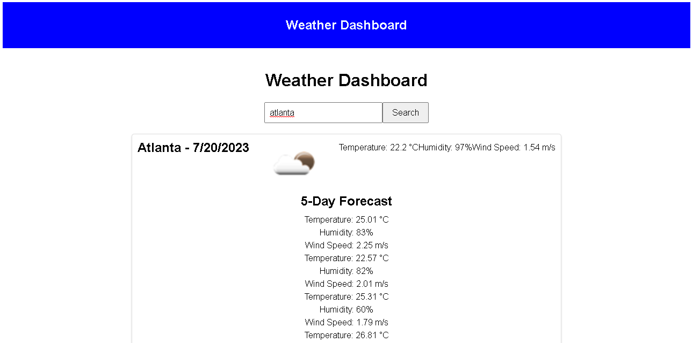

# api-hw-js

## functionality
in this assignment i used the weather api attached to the course readme and pulled its data into this webpage using a fetch call and javascript for loops.

on the page when a city is typed in you are given a weather card giving the weather data for that city at the current moment as well as 5 more cards displaying the weather forecast for the next 5 days as well. 

## image

## Links
Here is a link to the working code: https://trouterwen.github.io/api-hw-js/
here is a link to the this readme file: https://github.com/Trouterwen/api-hw-js/blob/main/README.md
here is a link to the Github repo: https://github.com/Trouterwen/api-hw-js